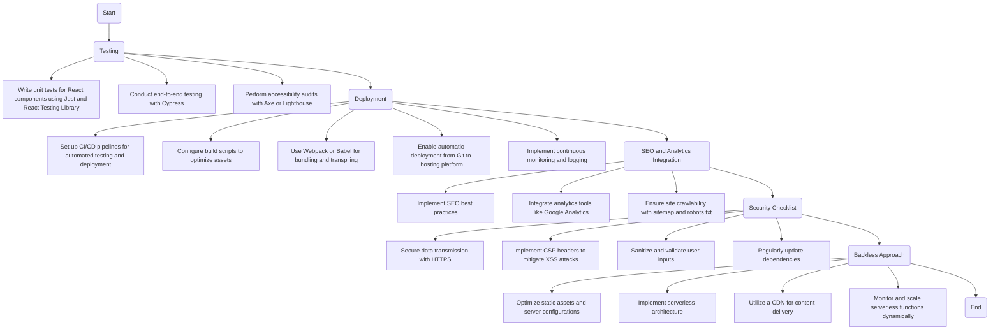

# webpage-wacoco-storybook

These are some of the nowle components built with React and Storybook.
## Install and run
```bash
npm i
npm run storybook
```

## Publish components

```bash
git commit .
git commit -m "Ready for release"
npm version patch/minor/major
git push
```

## Consumption of components

> Add a read only token in your ~/.npmrc, you will receive the token from owner of library.

```bash
cd ~
cd <PROJECT>
echo >> ~/.npmrc "//registry.npmjs.org/:_authToken=<MYTOKEN> #keep the token secret!
npm install @wacoco/webpage-components
```


WACOCO company's web page project


## Process



